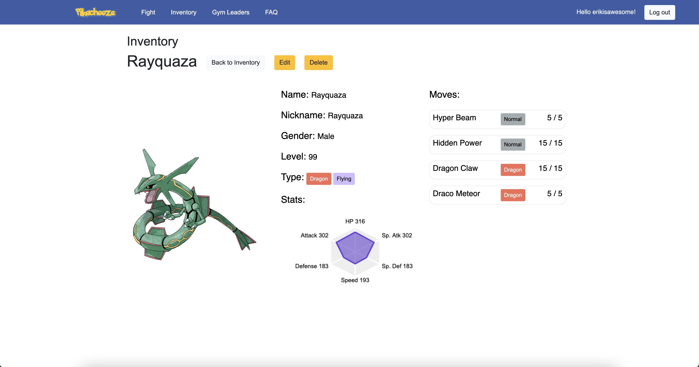
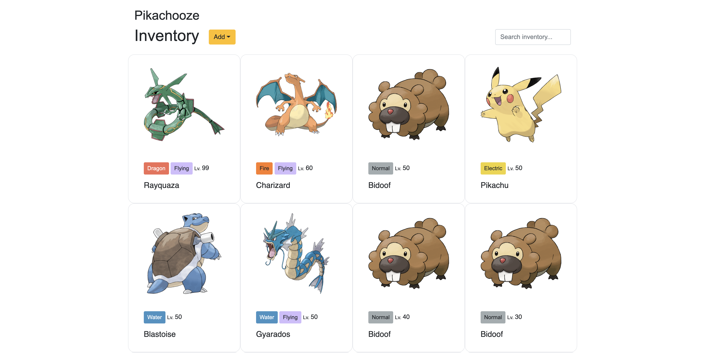
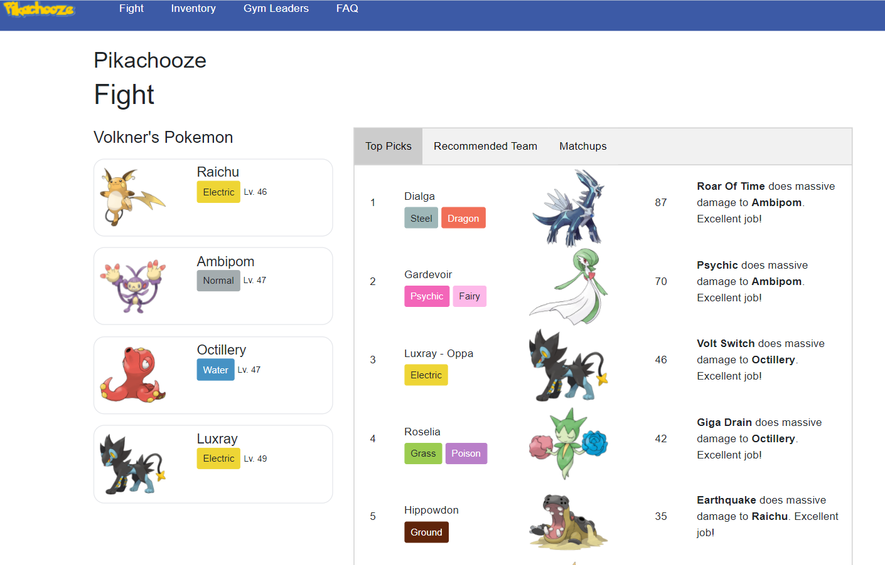
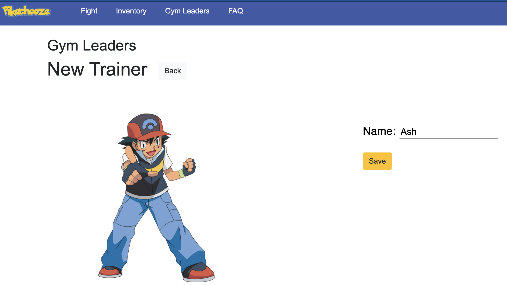

# Pikachooze
# Try It Out
During the Fall 2021 semester, try out our site at: http://34.139.249.180:5000/

Demo video is available at https://youtu.be/vGAJVO_0vqs
# Overview
Over the last two and a half decades since the launch of Pokemon, dozens of web apps have been created to accelerate progress, simplify content, and help dedicated players optimize their pokemon teams. Informative tools like Bulbapedia and strategy-based tools like Poke Assistant have become some of the most used resources of all time. Despite the far reaching capabilities of these websites, our team discovered a massive problem yet to be solved: how to find the optimal team for each gym leader/elite four based on a player’s own pokemon collection. With this in mind, our team spent the last two month creating a personalized tool that any player can use to upload pokemon, set levels & moves, choose gym leaders to battle, and discover the optimal team of 6 for every battle. We call this Pikachooze, and we believe that it can be used by millions of players worldwide. 

# Features
- Add, edit, remove the pokemon you've caught

- View and search all of your pokemon

- Compare your teams and get recommendations against gym leaders and the Elite 4 from generation IV games

- Suggest new trainers to test your teams!


# First time setup instructions:

0. Make sure that you have enabled [firewall settings](https://sites.duke.edu/compsci316_01_f2021/creating-and-running-vm-on-google-cloud/) for port 5000. This should be run on a CS 316-customized VM.

1. Clone this repo. Confirm with the team which branch you should be on for up to date behavior.

2. Upgrade pip if necessary, and run `pip install virtualenv`

3. Run `./install.sh`. If there are errors, address them.

4. Run `source env/bin/activate`

5. Run `flask run`

At this point, you can then access the database by running `psql pikachooze` from another terminal, and you can access the WebUI by navigating to the IP address and appending `:5000` to the URL. 

3. In your VM, move into the repository directory and then run `./install.sh`.
   This will install a bunch of things, set up an important file called `.flashenv`, and creates a simple PostgreSQL database named `amazon`.

Flask and SQLAlchemy will hot deploy most of your changes, but if an unusual problem arises, you can always do a hard reset by running:

1. `dropdb pikachooze` (make sure that any active database/`psql` connections have been terminated)

2. `flask run`

# Stopping

To stop your website, simply press <kbd>Ctrl</kbd><kbd>C</kbd> in the VM shell where flask is running.
You can then deactivate the environment using
```
deactivate
```

# Credits

Based on skeleton code for the CompSci 316 undergraduate course project.
Created by [Rickard Stureborg](http://www.rickard.stureborg.com) and [Yihao Hu](https://www.linkedin.com/in/yihaoh/).

- Fav Icon for browser taken from https://icons-for-free.com/iconfiles/png/512/pokemon-131979013310232399.png
- Pokemon data taken from https://pokeapi.co/
- Pokemon images taken from https://github.com/HybridShttps://github.com/HybridShivam/Pokemonhivam/Pokemon
- Trainer data taken from https://bulbapedia.bulbagarden.net/wiki/Main_Page
- Trainer images taken from https://pokemon.fandom.com/wiki/Pok%C3%A9mon_Wiki

# Useful Tips

## Fixes and tips
If weird functional or model interactions/errors happen during development, run 'dropdb pikachooze' and then 'flask run'. If you want to run sql queries, use 'psql pikachooze'. If you can't run 'source env/bin/activate', try upgrading pip and running 'pip install virtualenv'.
